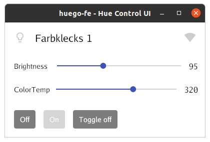

[](https://github.com/schnoddelbotz/huego-fe/actions?query=workflow%3Abuild)
[](https://goreportcard.com/report/github.com/schnoddelbotz/huego-fe)
[](https://coveralls.io/github/schnoddelbotz/huego-fe?branch=main)

# huego-fe

A cross-platform CLI, GUI and web - frontend for software remote control of Philips Hue bridges, based on [huego](https://github.com/amimof/huego).

`huego-fe` focuses on basic lights operations (on, off, brightness, ... more to come potentially).



## CLI usage

```bash
$ huego-fe
huego-fe can control your philips hue stuff

Usage:
  huego-fe [flags]
  huego-fe [command]

Available Commands:
  brightness  set light brightness
  colortemp   set light color temperature
  help        Help about any command
  list        A brief description of your command
  login       Discover Hue bridge and log in -- press link button first!
  off         fusion reactor control plane
  on          engage rocket launcher
  serve       exposes Hue lights control via an ugly web interface
  toggle      toggle toggles
  version     prints a bestseller novel on-demand

Flags:
      --config string         config file (default is $HOME/.huego-fe.yaml)
  -h, --help                  help for huego-fe
  -g, --hue-group int         Hue group No.# [$HUE_GROUP], see: huego-fe list (default 1)
  -i, --hue-ip string         Hue bridge IP [$HUE_IP] , see: huego-fe login -h
  -l, --hue-light int         Hue light No.# [$HUE_LIGHT], see: huego-fe list (default 1)
  -u, --hue-user string       Hue bridge user/token [$HUE_USER], see: huego-fe login -h
  -f, --light-filter string   exclude lights (provided as comma-separated list of IDs) from UI
  -s, --single-light          Apply operation on single light, not (default) group

  
Use "huego-fe [command] --help" for more information about a command.

```


## Installation

If you have [Go](https://golang.org/doc/install) installed and want to build from current master:

```bash
go get github.com/schnoddelbotz/huego-fe
```

Otherwise, [download a binary release](./../../releases), extract it and put the binary somewhere on your `PATH`.

## Setup / Usage / Examples

At first run after installation, `huego-fe` needs to be linked to your Hue.
Hue address and login data will be stored in `~/.huego-fe.yml`.
Should you ever want to re-link, delete the file.

*Note: Web currently still lacks color temperature and group control capabilities. Soon ...*

### Web

- Run `huego-fe serve --open-browser` (or `huego-fe s -o` for short). 

Your browser should open, showing huego-fe web UI, asking you to push link button. Once pressed, 
you should be warped into control UI.

### CLI

- Press Hue's link button to enable login
- Now run `huego-fe login` within a few seconds
- Try ...
  - `cat ~/.huego-fe.yml` to check generated config
  - `huego-fe list` to dump lights/groups including IDs to console
  - `huego-fe on` to power up the default lamp
  - `huego-fe b 64 -l 6` -- add `-l ...` to override default light; e.g. here: to set brightness of light 6 to 64
  - `huego-fe t` toggles the default light

### GUI

- just run `huego-fe` without any command line arguments to launch GUI.

Keyboard shortcuts:

| Key(s)                                         | Action                                              |
|------------------------------------------------|-----------------------------------------------------|
| <kbd>Tab</kbd>                                 | toggle between single-light and group control mode  |
| <kbd>⇧</kbd> / <kbd>⇩</kbd>                    | select light / group                                |
| <kbd>⇦</kbd> / <kbd>⇨</kbd>                    | brightness -/+ 20                                   |
|                                                | with <kbd>Ctrl</kbd>: brightness -/+ 10             |
|                                                | with <kbd>Alt</kbd>: brightness jump min/max        |
| <kbd>⇦</kbd> / <kbd>⇨</kbd> + <kbd>Shift</kbd> | color temperature -/+ 20                            |
|                                                | with <kbd>Ctrl</kbd>: color temperature -/+ 10      |
|                                                | with <kbd>Alt</kbd>: color temperature jump min/max |
| <kbd>PgUp</kbd> / <kbd>Home</kbd>              | power on                    |
| <kbd>PgDn</kbd> / <kbd>End</kbd>               | power off                   |
| <kbd>⏎</kbd> / <kbd>Enter</kbd>                | toggle power state          | 
| <kbd>Space</kbd>                               | toggle and quit             |
| <kbd>ESC</kbd>                                 | quit                        |

To override GUI startup default light (as read from `~/.huego-fe.yml`), use `-l` command line flag.
By putting e.g. `light-filter: "2,3,4,5"` into `~/.huego-fe.yml`, lights with given IDs will be hidden from UI.

#### Desktop integration

It might be handy to assign a Keyboard shortcut to start `huego-fe` GUI for regular use. 

##### Example setup for Gnome / Ubuntu 20.04:

- Go to settings > Keyboard shortcuts, scroll to bottom, hit `+`
- Given you put `huego-fe` into `$PATH` during installation, just use `huego-fe` here as Name and Command
- Click `Set Shortcut` and e.g. choose/press Ctrl-F12

Pressing Ctrl-F12 will now bring up `huego-fe` with default `hue-light` as set in `~/.huego-fe.yml`!

You may want to additionally assign `huego-fe toggle` (to e.g. Ctrl-Shift-F12), permitting direct toggling
of your default lamp.

### Example configuration file

The `.huego-fe.yml` gets written to your home directory upon initial Hue bridge pairing success and
read at each startup. Each setting maps to the command line flag of same name. Command line flags 
override config file settings. Example contents: 

```
# The following group filter will exclude group IDs 2,3,4,5 from UI (e.g. if no intent to ever control):
group-filter: "2,3,4,5"
# As for groups -- light exclusion filter. List IDs not to show in UI (control via CLI is still possible).
light-filter: "2,3,4,5"

# The default group ID to open in UI and to control via CLI if no group was provided, dto. for light:
hue-group: 1
hue-light: 6

# Command line flag -s / --single-light; defaults to false. Keep it like this, unless you want to
# exclusively use GUI and have it show single light control mode on every startup.
single-light: false

# Open a web browser when running huego-fe serve?
open-browser: false

# Bridge settings
hue-ip: http://192.168.78.128
hue-user: ...individual.key.from.pairing...
```

Using above config, and assuming we have light and group IDs 1-6 to control, we can now e.g. `t[oggle]` like this:

- `huego-fe t` will toggle default group (ID 1), as `--single-light` is false by default
- `huego-fe t 6` will toggle non-default group (ID 6)
- `huego-fe t -s` will toggle default light (ID 6)
- `huego-fe t -s 1` will toggle non-default light (ID 1)

# todo

- getting/setting colors, see
  - https://github.com/lucasb-eyer/go-colorful/issues/35
  - https://stackoverflow.com/questions/22564187/rgb-to-philips-hue-hsb
- cli: enable cobra shell auto-completion on commands / lights
- add a cmd/install_linux.go that permits simple installation of systemd socket-activated `huego-fe serve`?
- web: use index.tpl.html for link process, too; group+color temp control missing
- add `huego-fe schedule` to easily manage systemd timers / mac launchd / MS ScheduledTask?
- split gui and cli/web binaries? build time for CLI/web only usage concerns + mousetrap breaks cli on win 
- github action: add release builds; open: goreleaser vs cgo / how-to 

# kudos to ...

- [huego](https://github.com/amimof/huego) -- for making building `huego-fe` on top of it a simple joy
- [Gio](https://gioui.org/) -- for enabling `huego-fe` GUI
- [Cobra](https://cobra.dev/) -- for rocking `huego-fe` CLI

# bugs

Plenty for sure - have you seen a single test in here? Lame excuse: Toy project. Still, issues / PRs very welcome.
